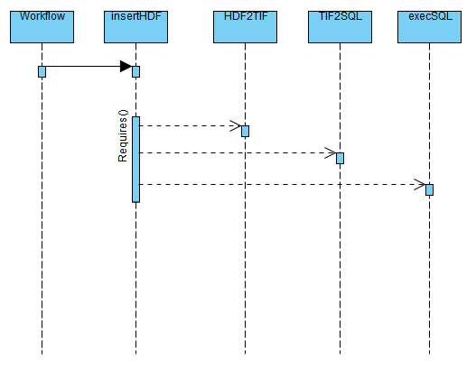
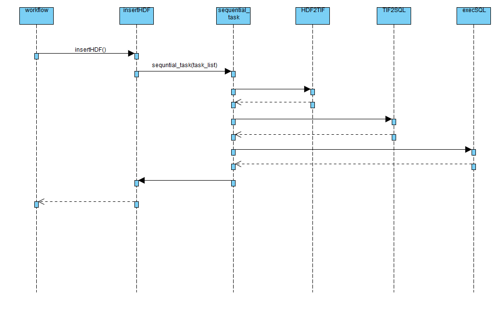

# The problem with sequential dependencies

Normally, whenever a simple task is run in Luigi with several dependencies, they all run concurrently with no deterministic order. That can lead to a problem when those tasks are related and need to be sequential.

To solve this problem, a sequential task is required. This task is a normal task called recursively to control flow execution.

This sequential task can be used at any point of the workflow execution, including the main task and just requires a list of task to be executed. The list must contain the tasks in the order they have to be executed.

The problem with this approach is that the main code is executed in the run function of a luigi task, and that way of execution serializes the objects passed as parameters.
